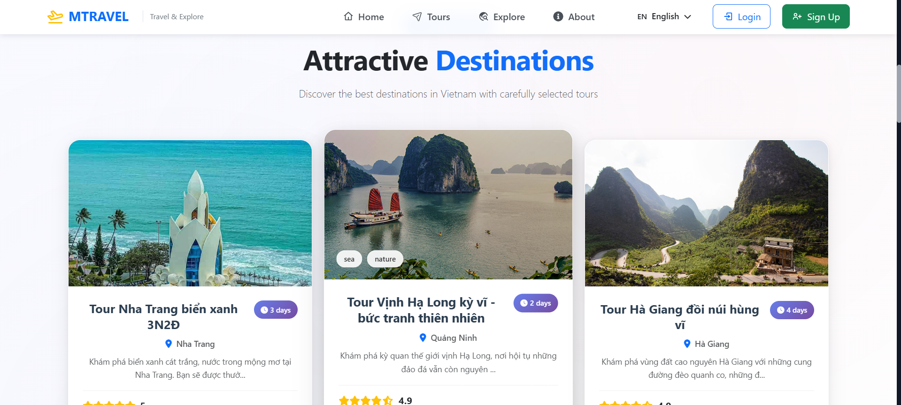

# Travel Tour Booking Website

This is a full-stack web application built using the **MERN Stack (MongoDB, Express.js, React.js, Node.js)**.  
The project aims to improve the **user experience in searching, comparing, and booking travel tours** by providing a centralized and intelligent platform.

---

## Project Objectives

### User Goals
Many users face difficulties when trying to find suitable tours due to:
- Scattered information across multiple platforms
- Lack of detailed filtering options
- Time-consuming communication with tour agencies

This website **centralizes tour information** and enables users to filter tours based on **destination, date, duration, and price**, allowing them to find the right tour quickly and effortlessly.

### Technical Goals
This project also serves as an opportunity to practice and apply full-stack web development skills using the MERN stack:
- Designing user interfaces with React.js
- Building RESTful APIs with Node.js & Express
- Managing and querying data using MongoDB
- Implementing user authentication with JWT
- Deploying the application in a real-world environment

---

## Features

- Browse and explore available travel tours
- Advanced filters by location, date, price, and duration
- Tour details page with itinerary, highlights, and schedule
- User authentication (JWT-based login/register)
- Tour booking functionality
- Admin dashboard (optional for future development)

---

## Tech Stack

| Layer        | Technology       |
|--------------|------------------|
| Frontend     | React.js, React Router, Bootstrap |
| Backend      | Node.js, Express.js |
| Database     | MongoDB (Mongoose) |
| Authentication | JSON Web Token (JWT) |
| Tools        | Swagger, Git, GitHub |

---
---

## Screenshots

### 🔹 Home Page

- The homepage displays a list of featured tours.
- Users can view an overview of available tours.

### 🔹 Explore Page

- Allows users to explore tours by region: North, Central, South.
- Include Travel guide

### 🔹 Tour Detail Page

- Shows detailed information for each tour: itinerary, highlights, schedules, and images.
- Users can book a tour directly from this page.

### 🔹 Booking Page

- Displays tours that the user has booked.
- Allows users to track booking information and status.

### 🔹 Login / Signup

  
  

- Provides user authentication with login and registration forms.

### 🔹 Profile Page

- Users can view and edit their personal information.

### 🔹 About Page

- Introduces the development team and describes the project’s goals.
